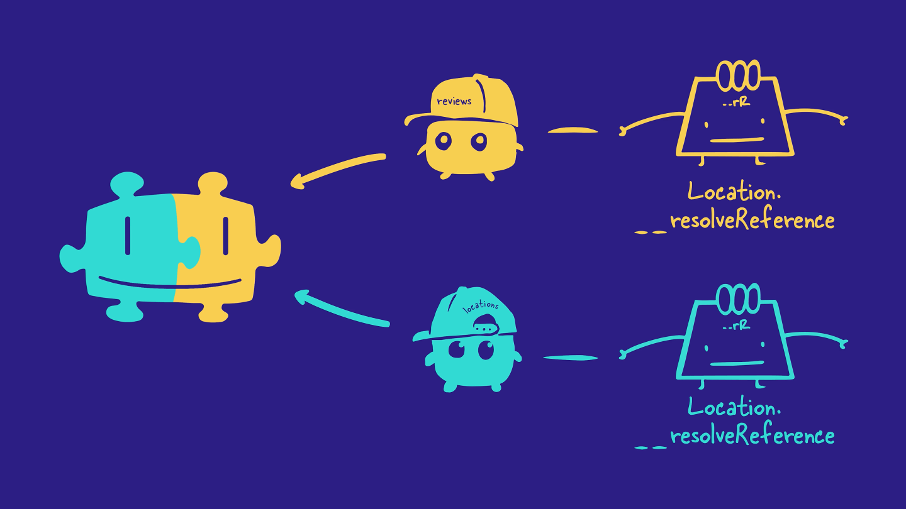

## Agreeing on a schema


### The homepage


```gql
query GetHomePageLocationsAndReviews {
  latestReviews {
    id
    comment
    rating
    location {
      name
    }
  }
  locations {
    id
    name
    overallRating
    photo
    reviewsForLocation {
      id
      comment
      rating
    }
  }
}
```

### The location details page

The next mock-up is for the location details page, which shows information about the destination, as well as all of its reviews.


The location details page needs data for one particular location, as well as other details and reviews for the location.

```gql
query GetLocationDetails($locationId: ID!) {
  location(id: $locationId) {
    id
    name
    description
    photo
    overallRating
    reviewsForLocation {
      id
      comment
      rating
    }
  }
}
```

This page also needs a way for users to submit new reviews. We'll write a mutation that allows us to do just that.

```gql
mutation SubmitReview($locationReview: LocationReviewInput) {
  submitReview(locationReview: $locationReview) {
    code
    success
    message
    locationReview {
      id
      comment
      rating
    }
  }
}
```

### Key takeaways

- Annotating UI mock-ups is one way to collaborate with the frontend team and implement a schema-first design process.
- Agreeing on your schema structure at the start of a new project means your frontend and backend teams can work in parallel.
- To decide how to split your schema into multiple subgraphs, you can group types and fields related to similar concerns.
- Each subgraph schema contains only the types and fields that particular subgraph is responsible for resolving.


## Building out the subgraphs

We'll start with the locations subgraph. Here's an architecture diagram showing the files in the subgraph-locations directory and how they're connected:


- `index.js`: Creates an ApolloServer instance that runs on port 4001. So far, this is just a normal GraphQL server, not a subgraph.
- `locations.graphql`: A schema that defines the types and fields owned by the locations subgraph.
- `resolvers.js`: Defines resolver functions for the fields in the locations schema.
- `datasources/LocationsApi.js`: Retrieves location data from the locations_data.json file.
  Note: In a real-world application, this data source would talk to a REST API or a database, but we're in tutorial-land so we'll stick with the hard-coded fake data.
- `datasources/locations_data.json`: A JSON object with hard-coded location data.


### key takeaways

- Adding a Federation 2 definition to the top of our schema file lets us opt in to the latest features available in Apollo Federation 2.
- To make an ApolloServer instance a federation-ready subgraph, use the buildSubgraphSchema function from the @apollo/subgraph package.

## Managed federation & the supergraph

`Managed federation` is an approach to maintaining a supergraph. With managed federation, updates to your supergraph schema are handled by Apollo Studio and the schema registry, all with zero downtime for your router - which we'll get to in a bit.

At a high-level, the managed federation workflow looks like this:

1. Backend developers design and build their subgraphs.
2. Someone creates a new supergraph in Apollo Studio.
3. Backend developers publish their subgraph schemas to the Apollo schema registry.
4. The schema registry automatically composes the subgraph schemas together into a supergraph schema. and makes it available via Apollo Uplink.
5. The router automatically polls Uplink for any new versions of the supergraph schema.


## Publishing the subgraphs with rover

To publish our subgraphs using Rover, we'll need to save two environment variables from Apollo Studio:

- `APOLLO_KEY`: An API key for authenticating Rover. It starts with something like `service:your-graph-name`.
- `APOLLO_GRAPH_REF`: The graph reference (or graph ref) for our supergraph, which we'll use to tell Rover where to publish our subgraphs.
  - A graph ref starts with the graph's ID, followed by an @ symbol, followed by the graph variant.


- [Tutorial Link](https://www.apollographql.com/tutorials/voyage-part1/06-publishing-the-subgraphs-with-rover)

# 7. How the router resolves data

We know that the router uses the supergraph schema to resolve incoming GraphQL operations from the client. But how exactly does that process work?

- Trace the journey of a client request through the supergraph
- Describe how the router creates query plans to resolve GraphQL operations across multiple subgraphs

## Step 1: The client request

First, the client sends a GraphQL operation to the router. The client has no clue which fields belong to which subgraphs—or even that there are subgraphs at all!

## Step 2: Building a query plan

The router looks at the fields in the operation and uses the supergraph schema to figure out which subgraphs are responsible for resolving each field.

It uses this information to build a query plan, a list of smaller GraphQL operations to execute on the subgraphs. The query plan also specifies the order in which the subgraph operations need to run.

## Step 3: Executing the query plan

Next, the router carries out the query plan by sending the smaller GraphQL operations to each of the subgraphs it needs data from.

The subgraphs resolve the operations the same way as any other GraphQL server: they use their resolvers and data sources to retrieve and populate the requested data.

## Step 4: The subgraph responses

The subgraphs send back the requested data to the router, and then the router combines all those responses into a single JSON object.

## Step 5: Sending data back to the client

Finally, the router sends the final JSON object back to the client. And that's the end of our operation's journey!

Here's the entire journey of a GraphQL operation through the supergraph, summarized in a single diagram:


## Key takeaways

- The router uses the supergraph schema to create a query plan for the incoming GraphQL operation. The query plan is a list of smaller operations the router can execute on different subgraphs to fully resolve the incoming operation.
- The router carries out the query plan by executing the list of operations on the appropriate subgraphs.
- The router combines all the responses from the subgraphs into a single JSON object, which it sends back to the client.

# 8. How the router resolves data

So far, FlyBy's subgraphs are running and their schemas have been published, but we still need one piece to tie everything together: the router.

- Set up the Apollo Router locally
- Connect our router to Apollo Studio
- Send our first query to our supergraph

## Downloading the router

The Apollo Router is a high-performance graph router built in Rust. It's available as an executable binary that you can add to your project in a few steps:

1. Open a terminal window and navigate to the `router` directory in the FlyBy project.

2. We'll download the Router by running the install command in the terminal.
   - Note: Visit the [official documentation](https://www.apollographql.com/docs/router/quickstart/#manual-download) to explore alternate methods of downloading the Router.

## Running the router

### 1

Back in the same terminal window, run the command below. You'll need to replace the `<APOLLO_KEY>` and `<APOLLO_GRAPH_REF>` placeholder values with your supergraph's corresponding values from the router/.env file. This command starts up the router locally and tells the router which supergraph to connect to.

```
APOLLO_KEY=<APOLLO_KEY> APOLLO_GRAPH_REF=<APOLLO_GRAPH_REF> ./router
```

### 2.

We'll see a few lines of router output, and finally a message that our router is running on port 4000, ready to receive queries!

Let's copy this address, we'll need it to set our connection settings in Studio. This tells outside consumers of our API what endpoint they can use to query our schema.

[Tutorial link](https://www.apollographql.com/tutorials/voyage-part1/08-router-configuration-and-uplink)


## Key takeaways

- The Apollo Router is an executable binary file that can be downloaded and run locally.
- The Query Plan Preview inspects the GraphQL operation in the Explorer and outputs the query plan the router will execute to resolve the operation.

# Step 9: Connecting Data Using Entities

The foundation of our supergraph is complete. We've separated FlyBy's schema into location data and review data, and we've implemented subgraphs that only define the types they're concerned with.

Revisiting our schema agreement checklist, we still have three fields that we don't know how to implement yet:

- `Location.reviewsForLocation` and `Location.overallRating`: These are both fields of the `Location` type, but we decided we want them to be owned by the `reviews` subgraph.
- `Review.location`: This is a field on the `Review` type (which lives in the `reviews` subgraph), but the field has a return type of `Location`, which is defined in the `locations` subgraph.


To implement these fields, we need to add a new tool to our developer tool belts: entities!

## What's an entity?

An entity is an object type with fields split between multiple subgraphs.

This means we can define a type that both of our subgraphs can contribute fields to and resolve independently.

In FlyBy, we want our reviews to include the location that they are written about. Our `Location` type needs to be used by both subgraphs, so we'll be turning the `Location` type into an entity.

A subgraph that defines an entity can do one or both of the following:

1. Reference the entity
2. Contribute fields to the entity

## Reference the entity

Referencing an entity means using it as a return type for another field defined in the subgraph.

For example, in the `reviews` subgraph, we can add a `location` field to the `Review` type, which will reference the `Location` entity as its return type.


## Contribute fields to the entity

Contributing fields to an entity means that one subgraph adds new fields to an entity that are specific to that subgraph's concerns.

For example, the `Location` entity will have fields for `name`, `description`, and `photo`, which will live in the `locations` subgraph. In other words, the `locations` subgraph contributes these fields to the `Location` entity.

And the `reviews` subgraph contributes two review-specific fields to the `Location` entity: `reviewsForLocation` and `overallRating`.


## How to create an entity

To convert an object into an entity in the subgraph schema, we need to do two things:

1. Define a primary key
2. Define a reference resolver

## Defining a primary key

An entity's `primary key` is the field (or fields) that can uniquely identify an instance of that entity within a subgraph. The router uses primary keys to collect data from across multiple subgraphs and associate it with a single entity instance.

For example, a location entity's primary key is its id. The router uses that id to collect data about a specific location instance, like a location with id "loc-1".


In each of our subgraph schemas, we can define a primary key for an entity, by adding the @key directive after the type's name.

The @key directive needs a property called fields, which we'll set to the field we want to use as the entity's primary key.

```gql
type EntityType @key(fields: "id")
```


## Defining a reference resolver function

Each subgraph that contributes fields to an entity also needs to define a special resolver function for that entity called a `reference resolver`. The router uses reference resolvers to directly access the entity fields that each subgraph contributes.



Every reference resolver has the name: `__resolveReference`. We define each entity's reference resolver right alongside all the field resolvers for that type.

The `__resolveReference` function has a slightly different signature from other resolver functions. Instead of the usual four arguments, `__resolveReference` only takes three:

- `reference`: The entity representation object that's passed in by the router. This tells the subgraph which instance of an entity is being requested. We'll cover what an entity representation is in the section below.
- `context`: The object shared across all resolvers. (This is the same as in normal resolvers, but note that by convention, we refer to this `__resolveReference` argument as `context`, rather than `contextValue` as in other resolvers!)
- `info`: Contains information about the operation's execution state, just like in a normal resolver. We won't use this argument much.


Let's focus on this first argument, `reference`, and learn more about entity representations.

What's an entity representation?
An entity representation is an object that the router uses to represent a specific instance of an entity. A representation always includes the typename for that entity and the `@key` field for the specific instance.

- The `__typename` field: This field exists on all GraphQL types automatically. It always returns the name of its containing type, as a string. For example, `Location.__typename`returns "Location".
- The `@key` field: The key-value pair that a subgraph can use to identify the instance of an entity. For example, if we defined the Location entity using the "id" field as a primary key, then our entity representation would include an "id" property with a value like "loc-2".
  An entity representation for a location might look like this:

```
{
  "__typename": "Location",
  "id": "loc-2"
}
```

You can think of an entity representation as a passport that the router uses to refer to a particular object between subgraphs.

The typename field is like a passport's country of origin. It says which entity the object belongs to. And the @key field is like a passport's ID number, uniquely identifying this instance of that entity.


## Key takeaways

- An entity is a type that can resolve its fields across multiple subgraphs.
  - To create an entity, we can use the `@key` directive to specify which field(s) can uniquely identify an object of that type.
  - We can use entities in two ways: - As a return type for a field (referencing an entity). - Defining fields for an entity from multiple subgraphs (contributing to an entity).
- Any subgraph that contributes fields to an entity needs to define a reference resolver function for that entity. This `__resolveReference` resolver is called whenever the router needs to access fields of the entity from within another subgraph.
- An entity representation is an object that the router uses to represent a specific instance of an entity. It includes the entity's type and its key field(s).
